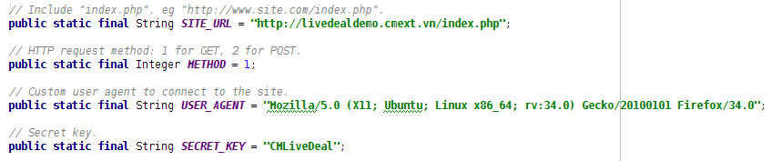

=============
Configuration
=============

CM Mobile
---------

Please check `CM Mobile's documentation <http://cm-mobile.readthedocs.org/en/latest/pages/configuration.html>`_ for how to confige CM Mobile.

The following settings need to be applied the same in CM Live Deal Customer application: HTTP request method, Allowed user agent, Secret key.

CM Live Deal Customer Android application
-----------------------------------------

First setup
^^^^^^^^^^^

After downloading the ZIP file of the project from our website, you extract the file on your component and open the project with your Android Studio. For example, with Android Studio's startup dialog, you select "Open an existing Android Studio project".

The project is linked to our Android SDK on our computer so Android Studio will detect that the path to our computer's Android SDK doesn't exist on your component, it will automatically sync the project with your computer's Android SDK.

Android Studio will check and updating required libraries in background tasks, you need to wait until the tasks are finished.

There could be some additional tasks depending on your Android Studio. For example you may need to install Build Tools 20.0.0 if you use an older version.

Now you can try the application with emulator or with your real Android device.

However, the application uses the data on `our demo site <http://livedealdemo.cmext.vn/>`_, please check the next section to know how to connect with your Joomla! website.

Try with your own site
^^^^^^^^^^^^^^^^^^^^^^

To connect the application to your Joomla!, you need to modify some settings in app/src/main/java/vn/cmext/cmlivedealcustomer/Constants.java

You need to change SITE_URL variable to your site's URL. The URL must contain "index.php" at the end.

If in CM Mobile's configuration, you use GET method, you set METHOD variable to 1. But if you use POST, you set the variable to 2.

Set USER_AGENT variable to the string you use for "Allowed user agent" option in CM Mobile's configuration.

Set SECRET_KEY variable to the string you use for "Secret key" option in CM Mobile's configuration.

You can try the application again, it should connect to your Joomla! and get the data from your CM Live Deal, now you can start customizing the application to suit your needs.